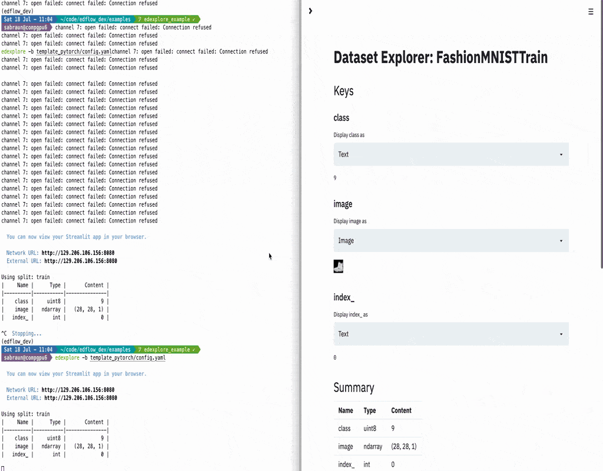
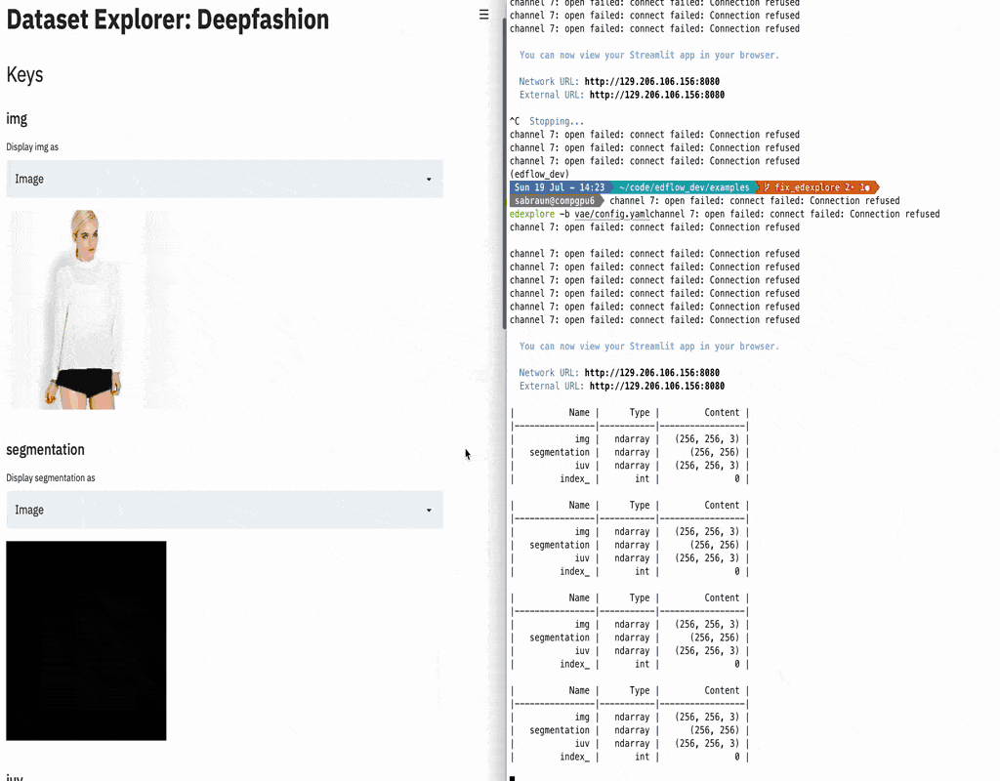
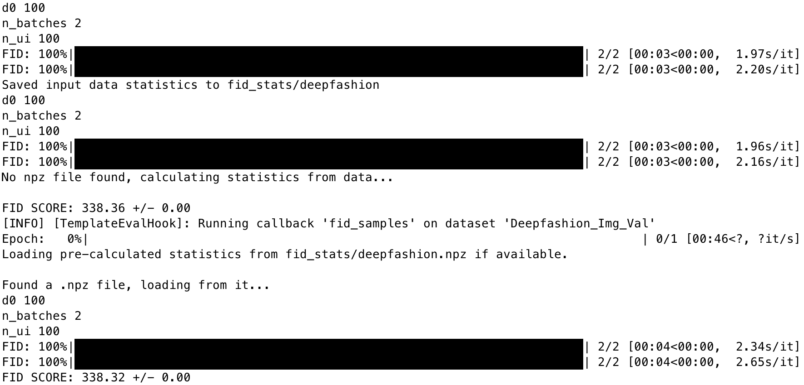

# Example

* explore dataset using `edexplore`
* on mnist


* on deepfashion, which has additional annotations such as segmentation and IUV flow.


```
export STREAMLIT_SERVER_PORT=8080
edexplore -b vae/config_explore.yaml
```


* train and evaluate model
```
edflow -b vae/config.yaml -t # abort at some point
edflow -b vae/config.yaml -p logs/xxx # will also trigger evaluation
```

* will generate FID outputs




## Working with MetaDatasets

* load evaluation outputs using the MetaDataset. Open `ipython`

```python
from edflow.data.believers.meta import MetaDataset
M = MetaDataset("logs/xxx/eval/yyy/zzz/model_outputs")
print(M)
# +--------------------+----------+-----------+
# |               Name |     Type |   Content |
# +====================+==========+===========+
# |           rec_loss |   memmap |    (100,) |
# +--------------------+----------+-----------+
# |            kl_loss |   memmap |    (100,) |
# +--------------------+----------+-----------+
# |   reconstructions_ |   memmap |    (100,) |
# +--------------------+----------+-----------+
# |           samples_ |   memmap |    (100,) |
# +--------------------+----------+-----------+

M.num_examples
>>> 100

M[0]["labels_"]
>>> {
    'rec_loss': 0.3759992,
    'kl_loss': 1.5367432,
    'reconstructions_': 'logs/xxx/eval/yyy/zzz/model_outputs/reconstructions_000000.png',
    'samples_': 'logs/xxx/eval/yyy/zzz/model_outputs/samples_000000.png'
}

# images are loaded lazily
M[0]["reconstructions"]
>>> <function edflow.data.believers.meta_loaders.image_loader.<locals>.loader(support='0->255', resize_to=None, root='')>

M[0]["reconstructions"]().shape
>>>(256, 256, 3)
```
